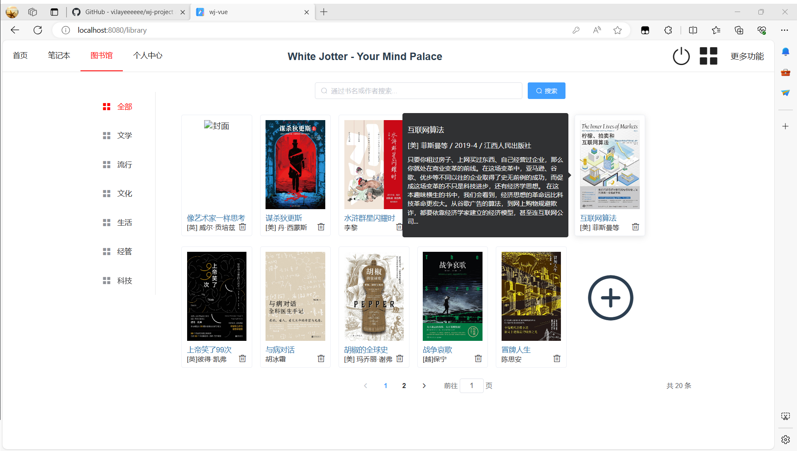
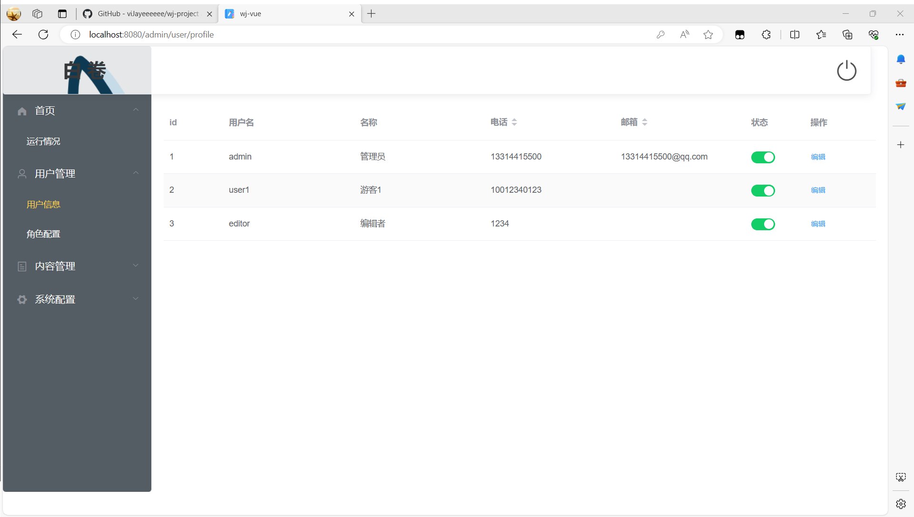

# wj-project
    该项目实现一个在线平台（白色笔记本），用户登录编辑查看发表文章，同时也收录书籍信息供查询。
白色笔记本，基于vue、springboot的全栈项目，前端是基于vue+element-ui在的单页面项目（webpack），后端主框架为Spring boot，数据库所属MySQL。 

本Github项目有三个分支：main、wj、wj-vue

# main
本分支负责介绍“白色笔记本”项目。

## wj
“白色笔记本”项目的后端源码

## wj-vue
“白色笔记本”项目的前端源码
# 界面及功能预览
1. 登录界面

2. 首页信息

3. 笔记本文章

4. 文章编辑及图片上传

上传结果

新文章详情（网页缩放至33%）

5. 图书列表及图书信息预览界面

6个人中心及后台管理界面
