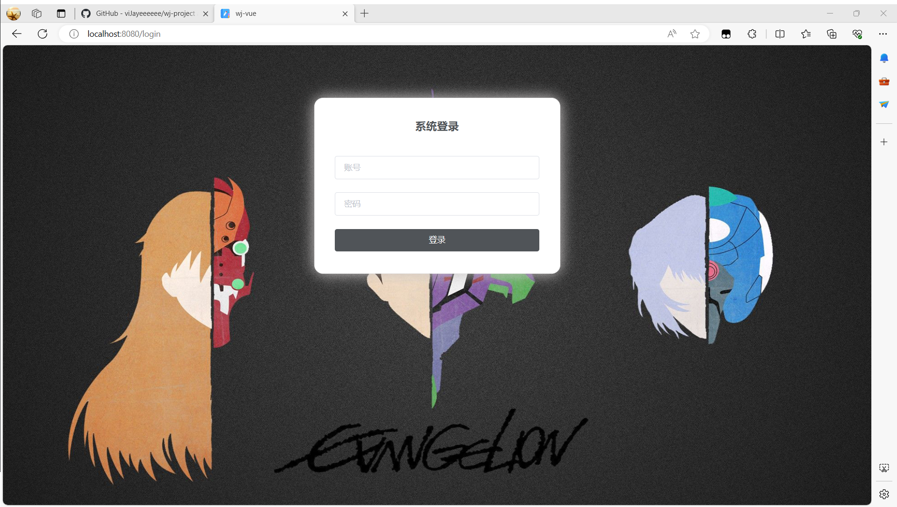
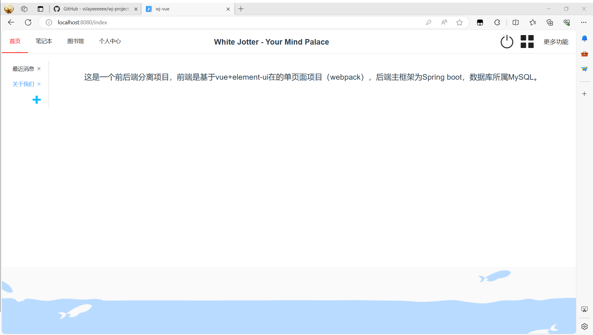
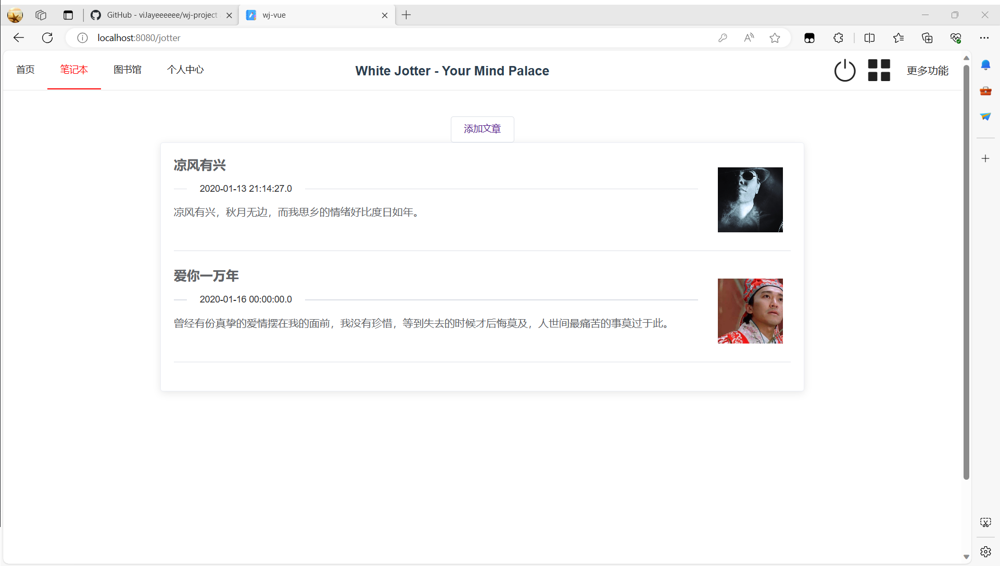
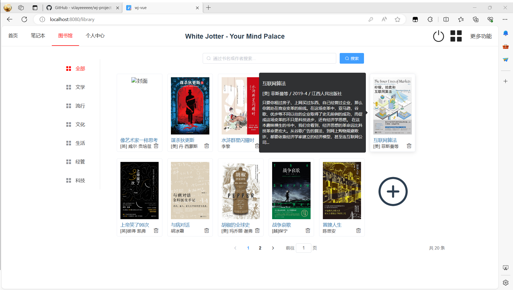
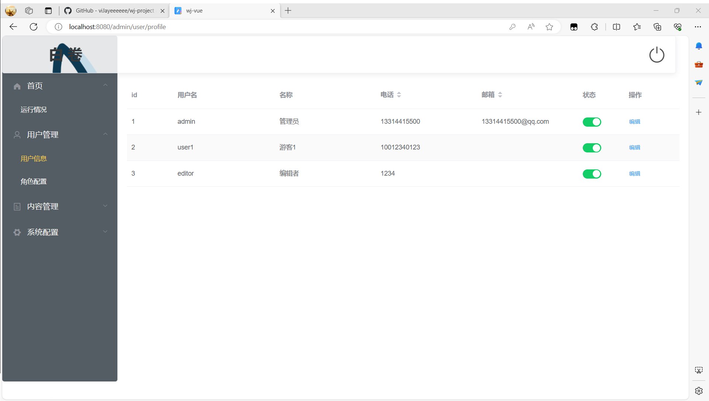

# wj-vue

> 基于vue的前端项目，本分支同步保存前端相关源码

# 前端整体界面预览
1. 登录界面

2. 首页界面

3. 文章列表界面

4. 图书列表及图书信息预览界面

5. 个人中心及后台管理界面

For a detailed explanation on how things work, check out the [guide](http://vuejs-templates.github.io/webpack/) and [docs for vue-loader](http://vuejs.github.io/vue-loader).
