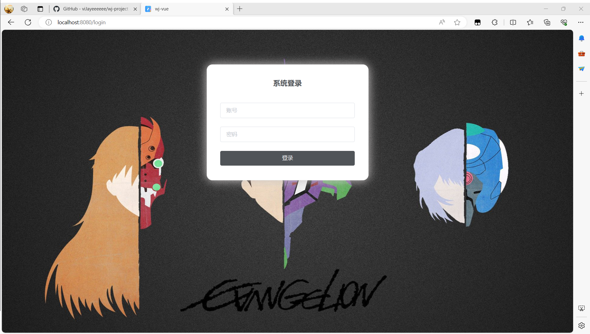
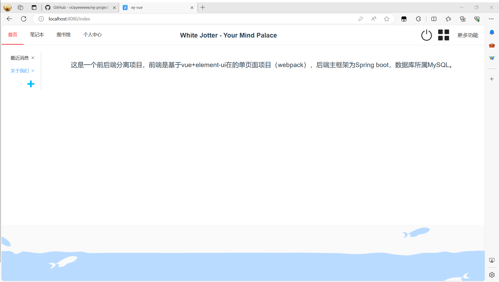
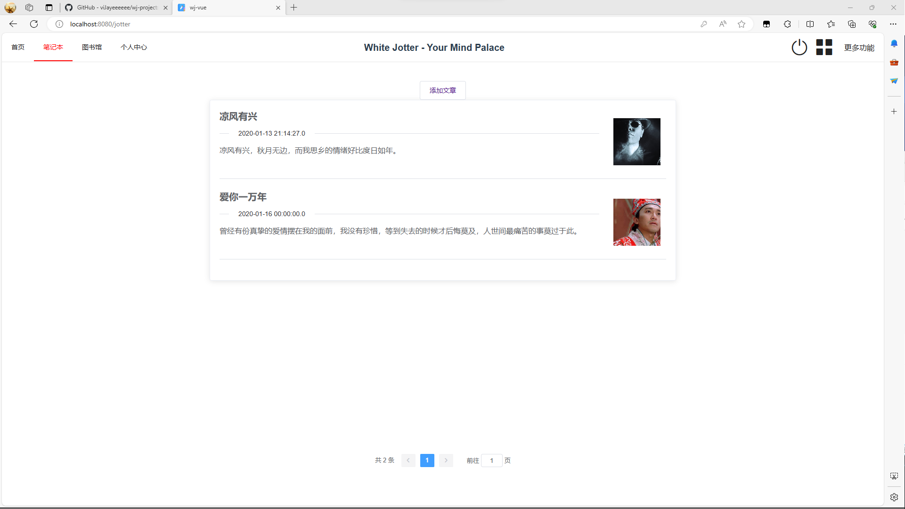
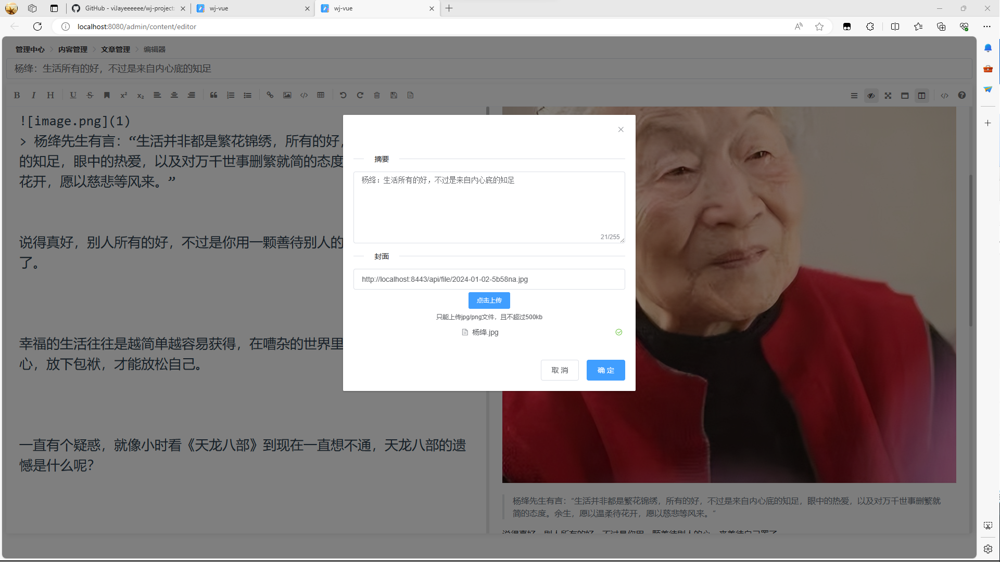
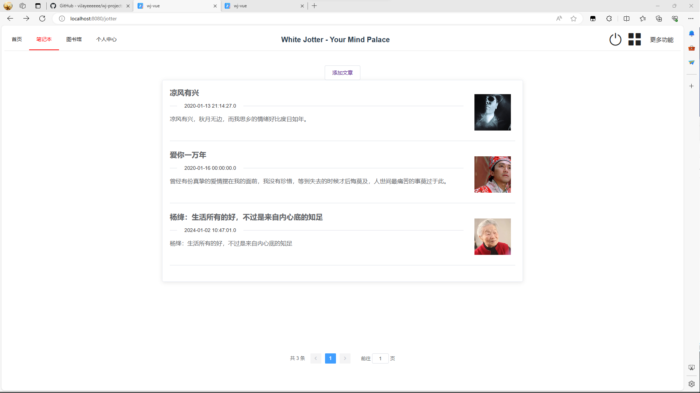
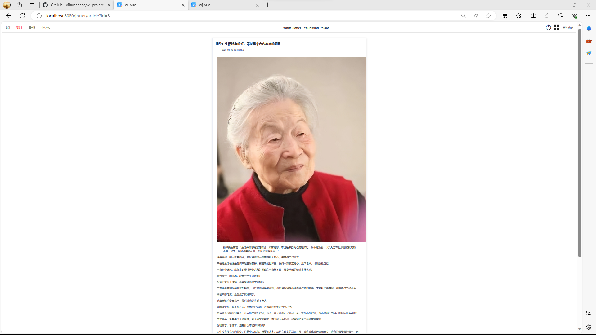

# wj-project
白色笔记本，基于vue、springboot的前后端项目

本Github项目有三个分支：main、wj、wj-vue

# main
本分支负责介绍“白色笔记本”项目。

## wj
“白色笔记本”项目的后端源码

## wj-vue
“白色笔记本”项目的前端源码
# 界面及功能预览
1. 登录界面

2. 首页信息

3. 笔记本文章

4. 文章编辑及图片上传

上传结果

新文章详情（图片缩放至33%）
